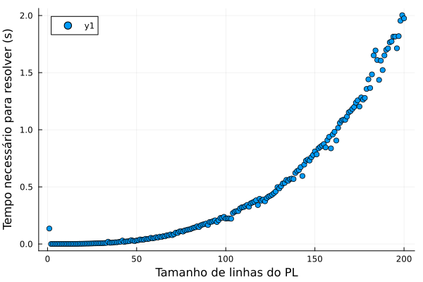
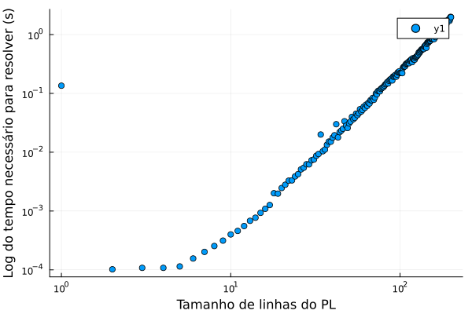

### SIMPLEX
Create the simplex algorithm in Julia language  

To use the function simplex, use the matrix A, vector b 

Ax = b

i is a optional param if the linear sistem have initial base in colum i+1

$$A \in \mathbb{R}^{n\times m},~ b\in \mathbb{R}^{m},  c \in \mathbb{R}^{m}~and~i\in \mathbb{R}$$

``` Simplex(A, b, c, i)```

this function return a vector (a, b)
a is the x minimum
b is the value of function in x minimum

The computational time is exponential



The logaritmum of computational time is linear



### Dual simplex

Create the Dual simplex algorithm in Julia language

To use the function simplex, use the matrix A, vector b 

Ax = b


$$A \in \mathbb{R}^{n\times m},~ b\in \mathbb{R}^{m},  c \in \mathbb{R}^{m}~and~i\in \mathbb{R}$$

``` DualA, b, c)```

this function return a vector (a, b)
a is the x minimum
b is the value of function in x minimum


### To-do
[] - define the return variable at dual simplex

[] - test dual simplex

[] - test time to solve dual simplex
